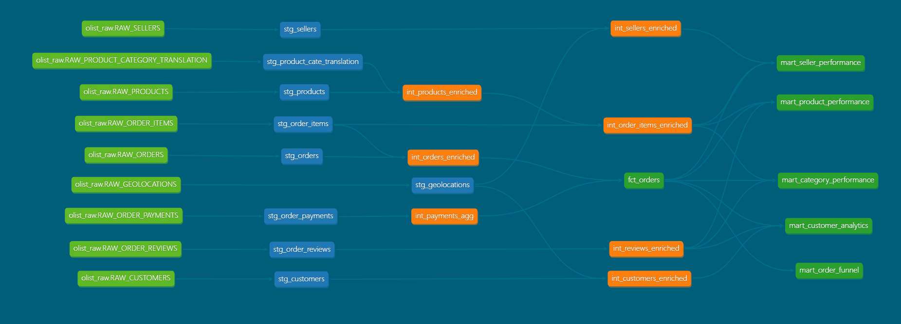

# Olist E-Commerce Analytics & AI Assistant | 2016 - 2018
An end-to-end analytics engineering and Generative AI project built using Snowflake, dbt, Streamlit, and Snowflake Cortex Analyst to transform raw marketplace data into robust data marts and a conversational self-service AI tool.

## Project Overview

This project transforms raw e-commerce data into clean analytical models and delivers business insights through a dual-interface system: an advanced business intelligence layer and a conversational natural language AI interface.

### Key Objectives:
- Structure robust, automated data pipelines using analytics engineering best practices.
- Democratize data access via an AI assistant that translates natural language to warehouse queries.
- Analyze e-commerce KPIs across revenue, delivery efficiency, and customer/seller behaviors.

## Cortex Analyst Demo

## Architecture

Raw Data → Snowflake → dbt Models → Streamlit App Interface / Tableau Dashboard

- **Snowflake**: Enterprise cloud data warehouse hosting raw, staging, and reporting schemas.
- **dbt Cloud**: Modular data transformation, testing, lineage tracking, and semantic documentation.
- **Snowflake Cortex Analyst**: LLM-powered agent evaluating a custom semantic layer to securely map natural language to accurate SQL.
- **Streamlit**: Responsive full-stack frontend application delivering a centralized reporting dashboard and a multi-turn chat assistant.
- **Tableau**: Advanced interactive visualization platform for deep-dive exploratory analytics.

## Data Modelling (dbt)

The core warehouse architecture follows a rigid, modular multi-layered modeling approach inside the `olist_project` workspace:

### 🔹 Staging Layer (`stg_*`)
- Cleans, casts, and standardizes raw data configurations.

### 🔹 Intermediate Layer (`int_*`)
- Handles downstream entity joins, aggregations, and business logic enrichment.
  - `int_orders_enriched`
  - `int_products_enriched`
  - `int_payments_agg`

### 🔹 Fact Table

#### `fct_orders`
**Grain:** One row per order item transaction.

**Key Columns:**
- `order_id`
- `customer_id`
- `purchased_at`
- `delivered_customer_at`

**Derived Metrics:**
- `delivery_time_days`
- `approval_delay_days`
- `is_delivered`
- `is_late_delivery`
- `payment_diff`
- `is_payment_mismatch`

### 🔹 Mart Layer (`mart_*`)
Business-ready analytical tables optimized for reporting runtime performance:

- `mart_customer_analytics` - Recency, frequency, and monetary analytics by customer.
- `mart_product_performance` - Item inventory sales volume and categorization trackers.
- `mart_seller_performance` - Micro-level geographical revenues and seller logistics.
- `mart_category_performance` - Translation-mapped item trends.
- `mart_order_funnel` - Funnel milestone conversion drops.
- `mart_order_experience` - Order-grain reporting mart containing delivery metrics and customer satisfaction scores.

## Conversational AI & Streamlit Layer (`olist_cortex_analyst`)

To bridge the gap between complex SQL schemas and non-technical stakeholders, the project features a full-stack **Streamlit** self-service analytics portal. 

### 🔹 Conversational Agent (Cortex Analyst)
Using a secure `.yaml` semantic description profile, Cortex Analyst interprets arbitrary user questions, checks definitions, generates optimized SQL on the fly, and queries the Snowflake warehouse to output interactive pandas dataframes and automatic visualizations.

- **Dynamic SQL Generation:** Translates complex context inquiries like *"Which seller states generate the most revenue?"* into warehouse syntax.
- **Thread-Safe State Isolation:** Leverages dynamic widget key rotation to preserve complete chat history arrays, interactive query results tables, and execution charts across long conversation loops.

## Dashboard Overview

The reporting layer features a dual-visualization setup: a centralized, high-performance monitoring panel built into the Streamlit UI, alongside an advanced, interactive business intelligence dashboard hosted on Tableau Public.

**View the Live Interactive Tableau Dashboard:** [Insert your Tableau Public Dashboard Link Here]

### 🔹 Executive KPIs
- **Total Revenue:** R$ 16.01M  
- **Total Orders:** 99.44K  
- **Average Order Value:** R$ 159.33  
- **Total Customers:** 96.48K  
- **Average Review Score:** 4.16  

### 🔹 Key Dashboard Views
- Revenue Trend (Monthly + Cumulative Area Profiling)
- Top Cities & Seller States by Revenue
- Order Delivery and Review Score Distribution Histograms
- Order Funnel Drop-off Tracking

## Key Insights

- São Paulo generates **~4x more revenue** than Rio de Janeiro, indicating heavy geographic demand concentration.
- Most deliveries successfully occur within **5–15 days**, with a median timeline around **~9 days**.
- Late deliveries serve as the **primary negative driver** for low review score metrics.
- Ibatinga represents a high-volume, lower-tier price seller cluster, whereas premium niche merchants capture significantly higher price segments.

## dbt DAG

- Raw sources → staging → intermediate → fact → marts  
- Central fact table: `fct_orders`  
- Downstream marts power the centralized metrics dashboard, Tableau worksheets, and structural parameters for the Cortex AI model.

## Tech Stack & Tools

- **Data Platform:** Snowflake
- **Data Transformation:** dbt Cloud
- **Frontend App Framework:** Streamlit
- **Generative AI Layer:** Snowflake Cortex Analyst
- **Business Intelligence:** Tableau Public
- **Data Visualization:** Plotly Express / Graph Objects
- **Languages:** SQL, Python (Pandas, NumPy)
