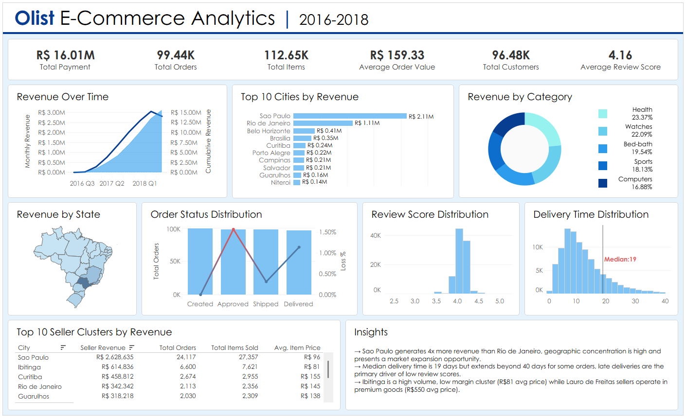
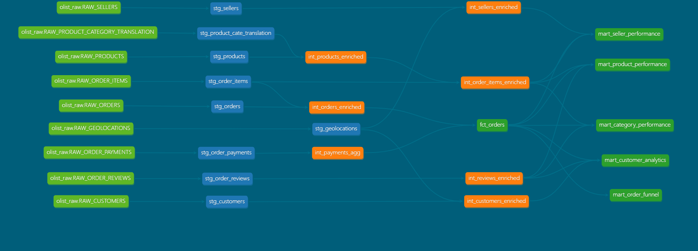

# Olist E-Commerce Analytics | 2016 - 2018
End-to-end analytics engineering project built using Snowflake, dbt, and Tableau to analyze e-commerce performance, delivery efficiency, and customer behavior.

## Project Overview

This project transforms raw e-commerce data into a clean analytical model and delivers business insights through interactive dashboards.

### Key Objectives:
- Analyze **revenue trends and growth**
- Evaluate **delivery performance and delays**
- Understand **customer and seller behavior**
- Identify **geographic revenue distribution across Brazil**

## 📦 Dataset

This project uses the **Olist E-Commerce Dataset**, which contains real-world transactional data from a Brazilian e-commerce platform.

### 📊 Dataset Overview:
- Time Period: 2016–2018  
- ~100K orders  
- ~96K customers    

### 📁 Key Tables:

- `orders` – order-level information and timestamps  
- `order_items` – product-level details per order  
- `order_payments` – payment transactions  
- `order_reviews` – customer feedback and ratings  
- `products` – product metadata  
- `sellers` – seller information  
- `customers` – customer details  
- `geolocation` – location data for mapping  

### 🔗 Source

The dataset is publicly available on Kaggle:

👉 [https://www.kaggle.com/datasets/olistbr/brazilian-ecommerce](https://www.kaggle.com/datasets/olistbr/brazilian-ecommerce)

### ⚠️ Notes

- Data required cleaning and standardization (handled in dbt staging layer)
- Some timestamps contain missing values (handled in transformations)
- Geolocation data was used to build Brazil-level maps in Tableau

## Architecture

Raw Data → Snowflake → dbt Models → Tableau Dashboard

- **Snowflake**: Data warehouse  
- **dbt**: Data transformation and modeling  
- **Tableau**: Data visualization 

## Data Modelling (dbt)

The project follows a layered modeling approach:

### 🔹 Staging Layer (`stg_*`)
- Cleans and standardizes raw data

### 🔹 Intermediate Layer (`int_*`)
Joins and enriches datasets  
- `int_customers_enriched`
- `int_order_items_enriched`
- `int_orders_enriched`
- `int_payments_agg`
- `int_products_enriched`
- `int_reviews_enriched`
- `int_seller_enriched`

### 🔹 Fact Table

#### `fct_orders`
**Grain:** One row per order

**Key Columns:**
- `order_id`
- `customer_id`
- `purchased_at`
- `delivered_customer_at`

**Derived Metrics:**
- `delivery_time_days`
- `approval_delay_days`
- `is_delivered`
- `is_late_delivery`
- `payment_diff`
- `is_payment_mismatch`

### 🔹 Mart Layer (`mart_*`)
Business-ready aggregated tables:

- `mart_customer_analytics`
- `mart_product_performance`
- `mart_seller_performance`
- `mart_category_performance`
- `mart_order_funnel`

## 📊 Dashboard Overview

### 🔹 Executive KPIs
- **Total Revenue:** R$ 16.01M  
- **Total Orders:** 99.44K  
- **Average Order Value:** R$ 159.33  
- **Total Customers:** 96.48K  
- **Average Review Score:** 4.16  

### 🔹 Key Visualizations

- 📈 Revenue Trend (Monthly + Cumulative)
- 🏙️ Top Cities by Revenue
- 🧾 Revenue by Category
- 🗺️ Revenue by State (Brazil Map)
- 📦 Order Status Distribution
- ⭐ Review Score Distribution
- 🚚 Delivery Time Distribution
- 🏪 Top Seller Clusters

[View Dashboard on Tableau Public](https://public.tableau.com/app/profile/prajjwal.dewangan/viz/OlistE-CommerceAnalytics_17776420545290/Dashboard2)

## 🔍 Key Insights

- São Paulo generates **~4x more revenue** than Rio de Janeiro, indicating strong geographic concentration.
- Most deliveries occur within **5–15 days**, with a median around **~9 days**.
- A small percentage of orders show **extreme delivery delays**, forming a long-tail distribution.
- Late deliveries are a **key driver of lower review scores**.
- Ibatinga represents a **high-volume, low-price seller cluster**, while premium sellers operate at significantly higher price points.

## 📈 Key Metrics

- Total Revenue  
- Total Orders  
- Average Order Value (AOV)  
- Median Delivery Time  
- Late Delivery %  
- Payment Mismatch Rate  

## 🗺️ dbt DAG

- Raw sources → staging → intermediate → fact → marts  
- Central fact table: `fct_orders`  
- Downstream marts power Tableau dashboards  

## ⚙️ Tech Stack

- **Snowflake** – Data Warehouse  
- **dbt** – Data Transformation  
- **Tableau** – Visualization  
- **SQL** – Data Modeling  
